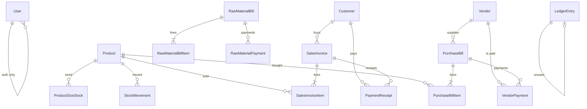

# PNS ERP — Database

PostgreSQL on **Supabase**. ORM: **Prisma** (`backend/prisma/schema.prisma`).

Pooled app URL: `DATABASE_URL` (port **6543**, `pgbouncer=true`).  
Migrations and `pg_dump`: `DIRECT_URL` (port **5432**).

Related: [`features/`](./features/README.md) · [`APIS.md`](./APIS.md)

---

## Commands

```bash
npm run prisma:migrate -w backend   # apply migrations
npm run prisma:studio -w backend    # browse tables
npm run seed -w backend             # admin + garvit (passwords from backend/.env)
npm run db:backup                   # full .dump → backups/
npm run db:backup:push              # dump + push to private DBDumps repo
npm run db:restore -- backups/tallypns-latest.dump
npm run db:export:sheets            # CSV/Excel copy — not a full restore
```

IDs are **cuid** strings. Money is `Decimal(14, 2)` unless noted. Prisma `Decimal` values are serialized as **strings** in JSON.

---

## Entity relationship



---

## Enums

| Enum | Values | Used on |
|------|--------|---------|
| `Role` | `ADMIN`, `STAFF` | `User.role` |
| `StockMovementType` | `IN`, `OUT`, `ADJUSTMENT` | `StockMovement.type` |
| `LedgerEntryType` | `DEBIT`, `CREDIT` | `LedgerEntry.type` (unused) |
| `PaymentMode` | `CASH`, `BANK` | receipts, vendor payments, raw-material payments |

---

## Models

### User

Login accounts. Refresh token is stored so a logout/rotation can revoke old tokens.

| Column | Type | Notes |
|--------|------|--------|
| `id` | String PK | cuid |
| `username` | String unique | Lowercased; `[a-zA-Z0-9._-]`, 2–32 chars |
| `email` | String unique | Auto `{username}@pnsenterprises.com` when created from Users UI |
| `passwordHash` | String | bcrypt |
| `name` | String | Display name |
| `role` | Role | Default `STAFF` |
| `refreshToken` | String? | Current refresh JWT |
| `createdAt` / `updatedAt` | DateTime | |

Seed: `admin` (ADMIN), `garvit` (STAFF). Passwords: `ADMIN_SEED_PASSWORD` / `GARVIT_SEED_PASSWORD`.

Cannot delete your own user or the last remaining ADMIN.

---

### Customer

| Column | Type | Notes |
|--------|------|--------|
| `id` | String PK | |
| `name` | String | Required |
| `phone` / `email` / `gstin` / `address` | String? | |
| `openingBalance` | Decimal(14,2) | Default 0; added to debtor outstanding |
| `createdAt` / `updatedAt` | DateTime | |

**Relations:** `salesInvoices`, `receipts`.

---

### Vendor

Same shape as Customer (`openingBalance` → creditor outstanding).

**Relations:** `purchaseBills`, `payments` (`VendorPayment`).

Not used for raw-material steel suppliers (those are free-text `supplierName` on `RawMaterialBill`).

---

### Product

Finished-goods catalog.

| Column | Type | Notes |
|--------|------|--------|
| `id` | String PK | |
| `name` | String | |
| `hsn` | String? | Printed and used in GSTR-1 |
| `gstRate` | Decimal(5,2) | Default 0 |
| `unit` | String | Default `PCS` |
| `price` | Decimal(14,2) | Used for stock *value* |
| `openingStock` | Decimal(14,2) | |
| `currentStock` | Decimal(14,2) | Sum of size stocks after movements |
| `createdAt` / `updatedAt` | DateTime | |

**Relations:** sales items, purchase items, `stockMovements`, `sizeStocks`.

---

### ProductSizeStock

Qty per pipe diameter. Unique `(productId, sizeMm)`. Index on `sizeMm`.

| Column | Type | Notes |
|--------|------|--------|
| `id` | String PK | |
| `productId` | FK → Product | Cascade delete |
| `sizeMm` | Decimal(10,2) | One of 95, 110, 90, 55, 45 |
| `quantity` | Decimal(14,2) | Default 0 |

Sales catalog lines and inventory adjustments change this table. Purchase bills currently update `Product.currentStock` only (not size rows).

---

### SalesInvoice

| Column | Type | Notes |
|--------|------|--------|
| `id` | String PK | |
| `invoiceNo` | String unique | `PNS/{YY}-{YY}/{n}` e.g. `PNS/26-27/1` |
| `customerId` | FK → Customer | Restrict (no cascade) |
| `invoiceDate` | DateTime | Default now |
| `transport` / `vehicleNo` | String? | Print |
| `totalAmount` | Decimal(14,2) | Inclusive of GST |
| `deletedAt` | DateTime? | Soft delete; indexed |
| `createdAt` / `updatedAt` | DateTime | |

**Relations:** `items`, `receipts`.

Lists and GST/reports use `deletedAt IS NULL`.

---

### SalesInvoiceItem

| Column | Type | Notes |
|--------|------|--------|
| `id` | String PK | |
| `salesInvoiceId` | FK → SalesInvoice | Cascade delete |
| `productId` | FK → Product? | **Null** = manual/non-stock line |
| `description` / `hsn` / `unit` | String? | Manual lines |
| `sizeMm` | Decimal(10,2)? | Catalog pipes only |
| `quantity` | Decimal(14,2) | |
| `rate` | Decimal(14,2) | Taxable rate |
| `gstRate` | Decimal(5,2) | |
| `amount` | Decimal(14,2) | qty × rate × (1 + gst/100) |

Either `productId` or `description` is required.

---

### PurchaseBill

| Column | Type | Notes |
|--------|------|--------|
| `id` | String PK | |
| `billNo` | String unique | `PB-{year}-{####}` |
| `vendorId` | FK → Vendor | |
| `billDate` | DateTime | |
| `transport` / `vehicleNo` | String? | |
| `totalAmount` | Decimal(14,2) | |
| `deletedAt` | DateTime? | Indexed |
| `createdAt` / `updatedAt` | DateTime | |

**Relations:** `items`, `payments`.

---

### PurchaseBillItem

| Column | Type | Notes |
|--------|------|--------|
| `id` | String PK | |
| `purchaseBillId` | FK → PurchaseBill | Cascade |
| `productId` | FK → Product | Required |
| `quantity` | Decimal(14,3) | Tons (or product unit) |
| `pricePerKg` | Decimal(14,4)? | If set, `rate = pricePerKg × 1000` |
| `rate` | Decimal(14,2) | ₹ per ton (or unit) |
| `gstRate` | Decimal(5,2) | |
| `amount` | Decimal(14,2) | |

---

### StockMovement

Audit of stock changes. Not reversed by deleting the row; sales/purchase services write compensating movements on edit/recycle.

| Column | Type | Notes |
|--------|------|--------|
| `id` | String PK | |
| `productId` | FK → Product | |
| `type` | StockMovementType | IN / OUT / ADJUSTMENT |
| `quantity` | Decimal(14,2) | Absolute qty of the move |
| `sizeMm` | Decimal(10,2)? | Set for sales OUT and adjustments |
| `reason` | String? | e.g. `Sales invoice PNS/26-27/1` |
| `createdAt` | DateTime | |

---

### PaymentReceipt

Money **in** from a customer against one sales invoice.

| Column | Type | Notes |
|--------|------|--------|
| `id` | String PK | |
| `receiptNo` | String unique | `RCP-` then 10001+ |
| `customerId` | FK → Customer | Copied from invoice |
| `salesInvoiceId` | FK → SalesInvoice | |
| `amount` | Decimal(14,2) | Cannot exceed invoice balance |
| `mode` | PaymentMode | CASH or BANK |
| `reference` | String? | Cheque / UTR |
| `receiptDate` | DateTime | |
| `narration` | String? | |
| `createdAt` / `updatedAt` | DateTime | |

Indexes: `salesInvoiceId`, `customerId`, `receiptDate`, `mode`.

Cannot record a receipt on a soft-deleted invoice or a fully paid invoice.

---

### VendorPayment

Money **out** to a vendor against one purchase bill. Same shape as receipts (`paymentNo` = `PAY-10001+`). Indexes on `purchaseBillId`, `vendorId`, `paymentDate`, `mode`.

---

### RawMaterialBill

Steel / MS tube supplier invoices. **Not** linked to `Vendor`.

| Column | Type | Notes |
|--------|------|--------|
| `id` | String PK | |
| `billNo` | String unique | Supplier’s invoice number |
| `supplierName` | String | |
| `supplierGstin` | String? | |
| `billDate` | DateTime | Indexed |
| `vehicleNo` / `destination` | String? | |
| `taxableAmount` | Decimal(14,2) | |
| `cgstAmount` / `sgstAmount` / `igstAmount` | Decimal(14,2) | |
| `roundOff` | Decimal(14,2) | |
| `totalAmount` | Decimal(14,2) | |
| `totalKg` | Decimal(14,3) | Sum of line kg |
| `notes` | String? | |
| `sourceFileName` | String? | Original PDF name if parsed |
| `deletedAt` | DateTime? | Indexed |
| `createdAt` / `updatedAt` | DateTime | |

Index on `supplierName`. **Relations:** `items`, `payments`.

Yield (pieces from kg) is **computed in the API**, not stored.

---

### RawMaterialBillItem

| Column | Type | Notes |
|--------|------|--------|
| `id` | String PK | |
| `billId` | FK → RawMaterialBill | Cascade |
| `description` | String | |
| `hsn` | String? | |
| `quantityKg` | Decimal(14,3) | |
| `ratePerKg` | Decimal(14,4) | |
| `amount` | Decimal(14,2) | kg × rate if omitted |

---

### RawMaterialPayment

| Column | Type | Notes |
|--------|------|--------|
| `id` | String PK | |
| `paymentNo` | String unique | `RMP-{n}` starting at 10001 |
| `billId` | FK → RawMaterialBill | Cascade |
| `amount` | Decimal(14,2) | |
| `mode` | PaymentMode | |
| `reference` / `narration` | String? | |
| `paymentDate` | DateTime | Indexed |
| `createdAt` / `updatedAt` | DateTime | |

Indexes: `billId`, `paymentDate`, `mode`.

---

### LedgerEntry

Reserved for a future general ledger. **No API writes this table.** Cash and bank books are derived from `PaymentReceipt` and `VendorPayment`.

| Column | Type | Notes |
|--------|------|--------|
| `id` | String PK | |
| `accountName` | String | |
| `type` | LedgerEntryType | DEBIT / CREDIT |
| `amount` | Decimal(14,2) | |
| `narration` | String? | |
| `entryDate` | DateTime | |
| `createdAt` | DateTime | |

---

## Soft delete

| Table | Soft delete? | Recycle-bin UI? |
|-------|----------------|-----------------|
| `SalesInvoice` | `deletedAt` | Yes |
| `PurchaseBill` | `deletedAt` | Yes |
| `RawMaterialBill` | `deletedAt` | No (API still filters `deletedAt`) |
| Masters, payments, stock | Hard delete | — |

Active filter: `{ deletedAt: null }` (`backend/src/lib/activeRecords.ts`).

Soft-deleting sales/purchase **reverses stock** and writes a compensating `StockMovement`. Restore writes the original direction again. Permanent delete does not change stock again.

---

## Derived fields (API, not columns)

Returned on invoices/bills:

| Field | Formula |
|-------|---------|
| `paidAmount` | Sum of receipts / payments |
| `balanceAmount` | `max(0, totalAmount − paidAmount)` |
| `paymentStatus` | `PENDING` / `PARTIAL` / `PAID` |
| `yield` (raw material) | kg × 9.1 (95 mm) and × 8.33 (110 mm) |

Party outstanding:

- **Debtors** = customer opening balance + unpaid sales
- **Creditors** = vendor opening balance + unpaid purchase

Balance sheet cash/bank = receipts − vendor payments by `PaymentMode` (raw-material payments are not included).

---

## Document number prefixes

| Document | Pattern | Generator |
|----------|---------|-----------|
| Sales invoice | `PNS/{FY}/{seq}` | FY = Apr–Mar (`26-27`); seq from 1 |
| Purchase bill | `PB-{year}-{seq}` | Calendar year; seq from count+1, 4 digits |
| Customer receipt | `RCP-{n}` | Starts at 10001 |
| Vendor payment | `PAY-{n}` | Starts at 10001 |
| Raw-material payment | `RMP-{n}` | Starts at 10001 |
| Raw-material bill | Supplier’s own number | Unique constraint |

---

## Pipe sizes and yield constants

Code (not DB lookup tables):

- Sizes: `95, 110, 90, 55, 45` mm — `backend/src/lib/pipeSizes.ts`
- Yield: 95 mm → 9.1 pcs/kg, 110 mm → 8.33 pcs/kg — `backend/src/lib/rawMaterialYield.ts`

---

## Migrations (apply in order)

| Migration | What it added |
|-----------|----------------|
| `20260723165951_init` | Users, masters, sales, purchase, stock, ledger |
| `20260724092551_add_sales_invoice_transport` | Sales transport / vehicle |
| `20260724121217_add_payments_receipts` | Receipts + vendor payments |
| `20260724122849_purchase_price_per_kg` | `PurchaseBillItem.pricePerKg` |
| `20260724123217_purchase_transport` | Purchase transport / vehicle |
| `20260724123409_sales_item_size_mm` | `SalesInvoiceItem.sizeMm` |
| `20260731104639_sales_manual_items` | Optional product, description/HSN/unit |
| `20260812125220_soft_delete_recycle_bin` | `deletedAt` on sales & purchase |
| `20260817172958_stock_by_pipe_size` | `ProductSizeStock` |
| `20260818123000_user_username` | `User.username` |
| `20260818184500_raw_material_bills` | Raw material + payments + `deletedAt` |

---

## Backups

Full restore = `pg_dump` custom format (`.dump`), never the pooler URL.

- Local: `backups/` (gitignored)
- Optional remote: private repo `vrajput032/DBDumps`
- Sheets export is human-readable only

See root `README.md` and `docs/DEPLOYMENT.md`.
